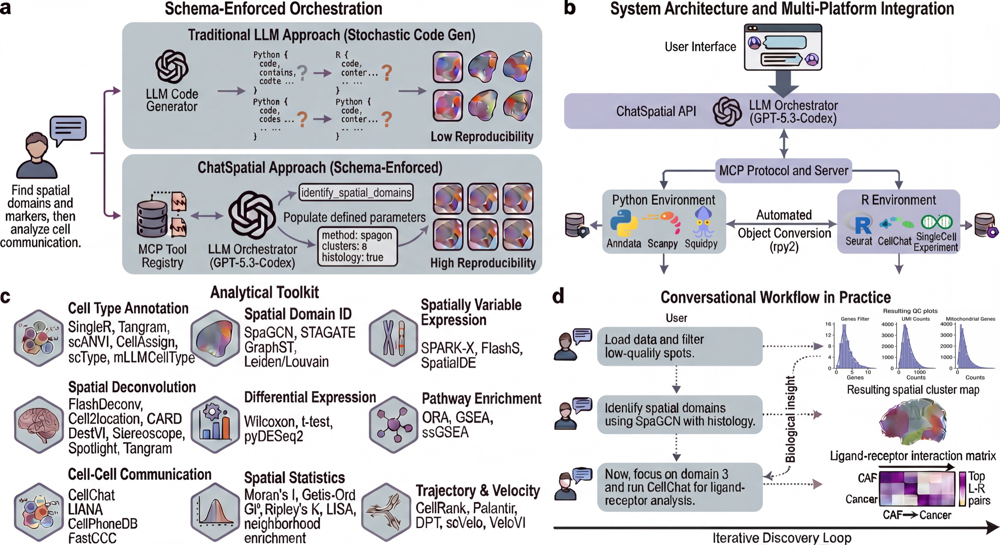

<div align="center">

# ChatSpatial

**MCP server for spatial transcriptomics analysis via natural language**

[](https://doi.org/10.64898/2026.02.26.708361)
[](https://openreview.net/forum?id=xZ814yNaUW)
[](https://github.com/cafferychen777/ChatSpatial/actions/workflows/ci.yml)
[](https://pypi.org/project/chatspatial/)
[](https://www.python.org/downloads/)
[](https://opensource.org/licenses/MIT)
[](https://cafferychen777.github.io/ChatSpatial/)

</div>

<p align="center">
  
</p>

ChatSpatial replaces ad-hoc LLM code generation with **schema-enforced orchestration** — the LLM selects methods and parameters from a curated registry instead of writing arbitrary code, ensuring reproducible results across sessions and platforms. It exposes **60+ spatial transcriptomics methods** as MCP tools that any compatible client can call.

---

## Quick Start

**Using Claude Code / Codex / OpenCode?** Just paste this:
```
Install ChatSpatial following https://github.com/cafferychen777/ChatSpatial/blob/main/INSTALLATION.md
```

<details>
<summary>Manual installation</summary>

```bash
# Install uv (recommended - handles complex dependencies)
curl -LsSf https://astral.sh/uv/install.sh | sh

# Create environment and install
python3 -m venv venv && source venv/bin/activate
uv pip install chatspatial

# Configure (use your venv Python path)
claude mcp add chatspatial /path/to/venv/bin/python -- -m chatspatial server
```
</details>

> **Works with any MCP-compatible client** — not just Claude. Use with [OpenCode](https://opencode.ai/), Codex, or any client supporting [Model Context Protocol](https://modelcontextprotocol.io/). Configure your preferred LLM (Qwen, DeepSeek, Doubao, etc.) as the backend.

See [Installation Guide](INSTALLATION.md) for detailed setup including virtual environments and all MCP clients.

---

## Usage

Talk to ChatSpatial in natural language:

```text
Load /path/to/spatial_data.h5ad and show me the tissue structure
```

```text
Identify spatial domains using SpaGCN
```

```text
Find spatially variable genes and create a heatmap
```

---

## Capabilities

60+ methods across 11 categories. Supports 10x Visium, Xenium, Slide-seq v2, MERFISH, seqFISH.

| Category | Methods |
|----------|---------|
| **Spatial Domains** | SpaGCN, STAGATE, GraphST, BANKSY, Leiden, Louvain |
| **Deconvolution** | FlashDeconv, Cell2location, RCTD, DestVI, Stereoscope, SPOTlight, Tangram, CARD |
| **Cell Communication** | LIANA+, CellPhoneDB, CellChat, FastCCC |
| **Cell Type Annotation** | Tangram, scANVI, CellAssign, mLLMCelltype, scType, SingleR |
| **Differential Expression** | Wilcoxon, t-test, Logistic Regression, pyDESeq2 |
| **Trajectory & Velocity** | CellRank, Palantir, DPT, scVelo, VeloVI |
| **Spatial Statistics** | Moran's I, Local Moran, Geary's C, Getis-Ord Gi*, Ripley's K, Co-occurrence, Neighborhood Enrichment, Centrality Scores |
| **Enrichment** | GSEA, ORA, Enrichr, ssGSEA, Spatial EnrichMap |
| **Spatial Genes** | SpatialDE, SPARK-X, FlashS |
| **Integration** | Harmony, BBKNN, Scanorama, scVI |
| **Other** | CNV Analysis (InferCNVPy, Numbat), Spatial Registration (PASTE, STalign) |

---

## Documentation

| Guide | Description |
|-------|-------------|
| [Installation](INSTALLATION.md) | Virtual environment setup, all platforms |
| [Quick Start](docs/quickstart.md) | 5-minute first analysis |
| [Examples](docs/examples.md) | Step-by-step workflows |
| [Methods Reference](docs/advanced/methods-reference.md) | All 20 tools with parameters |
| [Full Docs](https://cafferychen777.github.io/ChatSpatial/) | Complete reference |

---

## Citation

If you use ChatSpatial in your research, please cite:

```bibtex
@article{Yang2026.02.26.708361,
  author = {Yang, Chen and Zhang, Xianyang and Chen, Jun},
  title = {ChatSpatial: Schema-Enforced Agentic Orchestration for Reproducible and Cross-Platform Spatial Transcriptomics},
  elocation-id = {2026.02.26.708361},
  year = {2026},
  doi = {10.64898/2026.02.26.708361},
  publisher = {Cold Spring Harbor Laboratory},
  URL = {https://www.biorxiv.org/content/early/2026/03/01/2026.02.26.708361},
  journal = {bioRxiv}
}
```

ChatSpatial orchestrates many excellent third-party methods. **Please also cite the original tools your analysis used.** For example, if you ran spatial domain identification with SpaGCN, cite both ChatSpatial and SpaGCN. Each method's original publication can be found in its documentation or GitHub repository.

---

## Contributing

ChatSpatial is open to contributions! Whether it's bug reports, new analysis methods, documentation improvements, or feature requests — all are welcome. See [CONTRIBUTING.md](CONTRIBUTING.md) for guidelines.

<div align="center">

**MIT License** · [GitHub](https://github.com/cafferychen777/ChatSpatial) · [Issues](https://github.com/cafferychen777/ChatSpatial/issues)

</div>

<!-- mcp-name: io.github.cafferychen777/chatspatial -->
